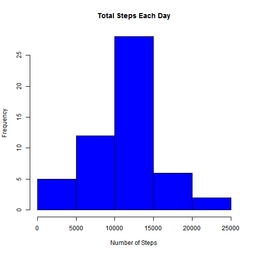
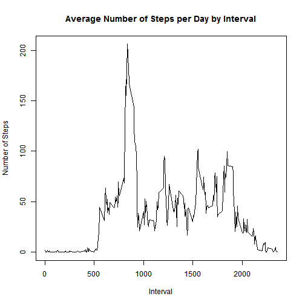
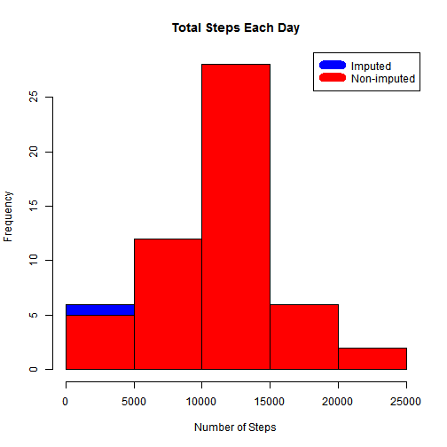
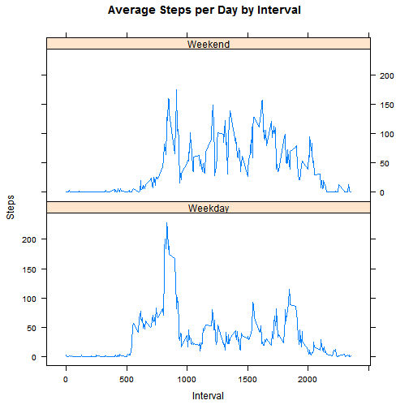

REPRODUCIBLE RESEARCH - ASSIGNMENT 1
========================================================
## Loading the data into a dataframe

```r
activityds <- read.csv('activity.csv')
```
## Omitting the NA Values

```r
activityds_nonas <- na.omit(activityds)
```
## Calculating Sum of steps by day, create Histogram for the sum, and calculate mean and median.

```r
sumres<-  aggregate(steps ~ date, activityds_nonas, sum)
hist(sumres$steps, main = paste("Total Steps Each Day"), col="blue", xlab="Number of Steps")
```

 

```r
mean_activityds_nonas <- mean(activityds_nonas$steps)
median_activityds_nonas <- median(activityds_nonas$steps)
```
## * Calculate average steps for each interval for all days. * Plot the Average Number Steps per Day by Interval. * Find interval with most average steps. 

```r
steps_by_interval <- aggregate(steps ~ interval, activityds_nonas, mean)
plot(steps_by_interval$interval,steps_by_interval$steps, type="l", xlab="Interval", ylab="Number of Steps",main="Average Number of Steps per Day by Interval")
```

 

```r
max_interval <- steps_by_interval[which.max(steps_by_interval$steps),1]
```
## Impute missing values. Compare imputed to non-imputed data.

```r
incomplete <- sum(!complete.cases(activityds))
imputed_activityds <- transform(activityds, steps = ifelse(is.na(activityds$steps), steps_by_interval$steps[match(activityds$interval, steps_by_interval$interval)], activityds$steps))
activityds[as.character(activityds$date) == "2012-10-01", 1] <- 0
sumres_i <- aggregate(steps ~ date, activityds, sum)
hist(sumres_i$steps, main = paste("Total Steps Each Day"), col="blue", xlab="Number of Steps")
hist(sumres$steps, main = paste("Total Steps Each Day"), col="red", xlab="Number of Steps", add=T)
legend("topright", c("Imputed", "Non-imputed"), col=c("blue", "red"), lwd=10)
```

 

```r
mean_activityds.i <- mean(sumres_i$steps)
median_activityds.i <- median(sumres_i$steps)
mean_diff <- mean_activityds.i - mean_activityds_nonas
med_diff <- median_activityds.i - median_activityds_nonas
total_diff <- sum(sumres_i$steps) - sum(sumres$steps)
```
## Differences in activity patterns between weekdays and weekends

```r
weekdays <- c("Monday", "Tuesday", "Wednesday", "Thursday", "Friday")
activityds$dow = as.factor(ifelse(is.element(weekdays(as.Date(activityds$date)),weekdays), "Weekday", "Weekend"))
steps_by_interval_i <- aggregate(steps ~ interval + dow, activityds, mean)
library(lattice)
```

```
## Warning: package 'lattice' was built under R version 3.0.3
```

```r
xyplot(steps_by_interval_i$steps ~ steps_by_interval_i$interval|steps_by_interval_i$dow, main="Average Steps per Day by Interval",xlab="Interval", ylab="Steps",layout=c(1,2), type="l")
```

 
